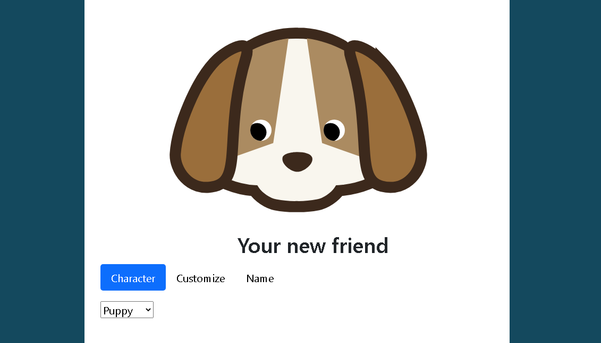

# Project Name
> Eye Exercise Project

## Table of contents
* [General info](#general-info)
* [Screenshots](#screenshots)
* [Technologies](#technologies)
* [Setup](#setup)
* [Features](#features)
* [Status](#status)
* [Inspiration](#inspiration)
* [Contact](#contact)

## General info
Our initial project was to 

## Screenshots

## Technologies
* HTML
* CSS
* JavaScript

## Setup
Feel free to fork it and make your own changes. Check out the project here (https://danielwestfall.github.io/eyeExercise/eyeexercise.html). You can also download the files locally and unzip them to a folder and run them in your favorite web browser.

## Code Examples
Examples of usage:
`put-your-code-here`

## Features
List of features:
* Added a character creation screen theme
* Bootstrap menu added via BootstrapCDN
* Choose your character - simply choose the template from the drop down menu
* Customize your character - pick your colors via two color selector boxes and then click on the part of the character you want to change 
* Rename your character

To-do list:
* Add randomly generated character creation
* Add more character types from the Chinese zodiac (my wife's request)
* Create a mad-libs style backstory generator

## Status
Project is: _in progress_

Project done to class specifications. I plan on playing with the CSS to see what kind of eyes I can make and how to move the eyes more.

## Inspiration
Project created by MIT xPro Full Stack Web Development Course. 

Artwork used was taken from FreeSVG.org and understood to be under Creative Commons 0 license via FreeSCG.org. See the links to each below. 

FreeSVG.org
https://freesvg.org/

Japanese Dou Shou Qi dog vector illustration
https://freesvg.org/japanese-dou-shou-qi-dog-vector-illustration

Doushouqi elephant
https://freesvg.org/doushouqi-elephant

Japanese Dou Shou Qi tiger vector illustration
https://freesvg.org/japanese-dou-shou-qi-tiger-vector-illustration

Japanese Dou Shou Qi rat vector clip art
https://freesvg.org/japanese-dou-shou-qi-rat-vector-clip-art

Japanese Dou Shou Qi lion vector graphics
https://freesvg.org/japanese-dou-shou-qi-lion-vector-graphics

Japanese Dou Shou Qi leopard vector clip art
https://freesvg.org/japanese-dou-shou-qi-leopard-vector-clip-art

Japanese Dou Shou Qi wolf vector graphics
https://freesvg.org/japanese-dou-shou-qi-wolf-vector-graphics

Japanese Dou Shou Qi cat vector image
https://freesvg.org/japanese-dou-shou-qi-cat-vector-image

## Contact
Created by [@danwestfall6](https://danielwestfall.github.io/) - feel free to contact me!

## License
MIT
